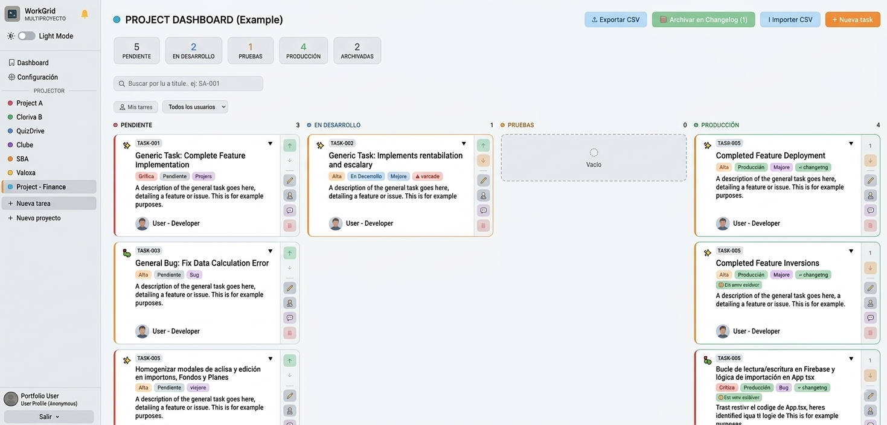
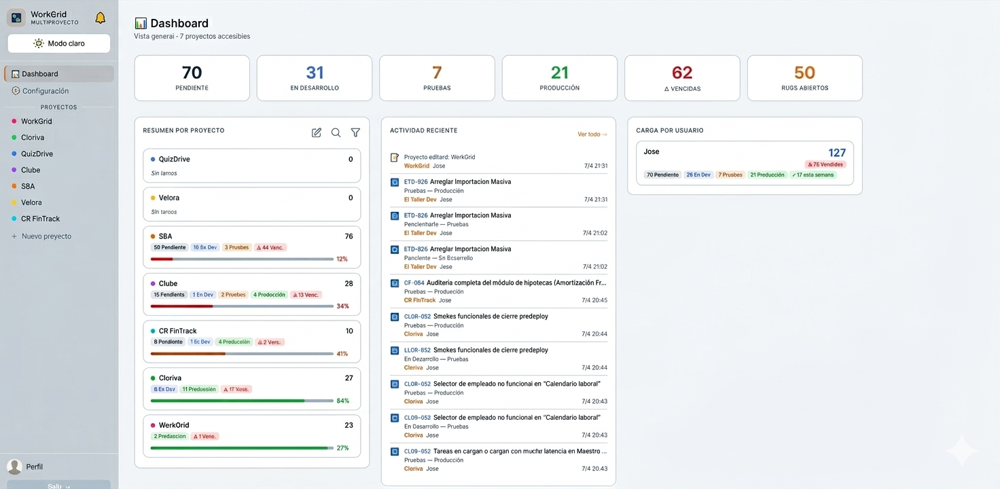

# WorkGrid

[](https://www.paypal.com/donate/?business=josejcoy%40gmail.com&currency_code=EUR&item_name=Support%20WorkGrid)

> Self-hosted task management · React + Firebase + Vercel  
> Gestión de tareas auto-alojada · React + Firebase + Vercel

If WorkGrid helps you, consider supporting development via PayPal.  
Si WorkGrid te resulta útil, considera apoyar el desarrollo a través de PayPal.

---

## Table of contents / Índice

- [English](#english)
  - [What is WorkGrid?](#what-is-workgrid)
  - [Features](#features)
  - [Requirements](#requirements)
  - [Install](#install)
  - [WorkGrid CLI](#workgrid-cli)
  - [REST API](#rest-api)
  - [Privacy note](#privacy-note)
- [Español](#español)
  - [¿Qué es WorkGrid?](#qué-es-workgrid)
  - [Características](#características)
  - [Requisitos](#requisitos)
  - [Instalación](#instalación)
  - [WorkGrid CLI](#workgrid-cli-1)
  - [API REST](#api-rest-1)
  - [Privacidad](#privacidad)

---

## Screenshots

### Dashboard


### Project Board


---

## English

### What is WorkGrid?

WorkGrid is a multi-project task board where tasks move through a linear state machine:

```
Pending → In Progress → Testing → Production
```

It ships with a REST API and a standalone CLI tool for automation and external integrations.

### Features

| Feature | Description |
|---------|-------------|
| **Multi-project board** | Separate kanban-style board per project with priorities, types, deadlines |
| **Linear state machine** | Pending → In Progress → Testing → Production |
| **REST API** | Vercel serverless endpoint at `/api/taller` |
| **WorkGrid CLI** | Standalone HTML tool — no build step, works offline |
| **Dynamic schema** | CLI inspects `/schema` on connect and adapts to custom fields |
| **Controlled transitions** | Verification gate before each state advance; two-step confirm for Production |
| **Bulk import** | Paste structured text tasks; content-hash deduplication |
| **CSV import/export** | Excel-friendly per-project export and import |
| **Backup system** | Full JSON snapshots with conflict resolution and re-linking tool |
| **App Check** | Firebase App Check with reCAPTCHA v3 support |
| **Access control** | Per-project read/write user lists; super-admin role |

### Requirements

1. Node.js LTS
2. A Firebase project (free Spark plan works)
3. A Vercel account (free Hobby plan works)

### Install

```bash
git clone https://github.com/josejnet/WorkGrid
cd WorkGrid
npm install
```

Copy `.env.example` to `.env.local` and fill in your Firebase values:

```env
VITE_FIREBASE_API_KEY=
VITE_FIREBASE_AUTH_DOMAIN=
VITE_FIREBASE_PROJECT_ID=
VITE_FIREBASE_STORAGE_BUCKET=
VITE_FIREBASE_MESSAGING_SENDER_ID=
VITE_FIREBASE_APP_ID=
VITE_SUPER_ADMIN=your@email.com

# Optional — restrict sign-in to a domain or specific emails
VITE_ALLOWED_DOMAIN=yourcompany.com
VITE_ALLOWED_EMAILS=alice@gmail.com,bob@gmail.com

# Optional — Firebase App Check
VITE_RECAPTCHA_SITE_KEY=
```

Start locally:

```bash
npm run dev
```

Deploy to Vercel:

```bash
npx vercel --prod
```

Add the following env var in Vercel to enable the REST API:

```
FIREBASE_SERVICE_ACCOUNT_B64=<base64-encoded Firebase service account JSON>
```

The first user to register becomes admin automatically.

---

### WorkGrid CLI

`public/workgrid-cli.html` is a zero-dependency standalone tool for interacting with any WorkGrid deployment:

- Connect with URL + Bearer token
- Browse and filter tasks by state, priority, or project
- Advance task state with verification gates and two-step confirm for Production
- Bulk import tasks from structured text
- Bulk import supports explicit multiline blocks using `<<INICIO>>` / `<<FIN>>`
- Import parser keeps backward compatibility with legacy indented text and returns clear errors for malformed blocks
- **Dynamic schema inspection** — fetches `/schema` on connect and adapts field handling automatically

Open it directly in a browser (`file://`) or serve it from your Vercel deployment at `/workgrid-cli.html`.

---

### REST API

WorkGrid exposes a serverless API at `/api/taller`.

#### Enable the API

Go to **Settings → Project Master**, open a project, and click **Generate API token**.  
Use the token as `Authorization: Bearer <token>` on every request.

#### Endpoints

| Method | Path | Description |
|--------|------|-------------|
| `GET` | `/api/taller/schema` | Discover fields and state machine |
| `GET` | `/api/taller/tasks` | List tasks (filter by `estado`, `projectId`, `tipo`, `prioridad`) |
| `GET` | `/api/taller/tasks/:id` | Get one task |
| `POST` | `/api/taller/tasks` | Create a task |
| `POST` | `/api/taller/tasks/:id/advance` | Advance task to next state |

---

### Privacy note

This public repo contains no personal data:
- No private `.env` secrets (only `.env.example` with placeholders)
- No personal task exports or backups
- Firebase config comes entirely from your own env vars

---

---

## Español

### ¿Qué es WorkGrid?

WorkGrid es un gestor de tareas multi-proyecto donde las tareas avanzan por una máquina de estados lineal:

```
Pendiente → En Desarrollo → Pruebas → Producción
```

Incluye una API REST y una herramienta CLI standalone para automatización e integraciones externas.

### Características

| Característica | Descripción |
|---------------|-------------|
| **Tablero multi-proyecto** | Tablero estilo kanban por proyecto con prioridades, tipos y plazos |
| **Máquina de estados lineal** | Pendiente → En Desarrollo → Pruebas → Producción |
| **API REST** | Endpoint serverless en Vercel en `/api/taller` |
| **WorkGrid CLI** | Herramienta HTML standalone — sin build, funciona offline |
| **Schema dinámico** | La CLI inspecciona `/schema` al conectar y adapta el manejo de campos |
| **Transiciones controladas** | Verificación antes de avanzar estado; doble confirmación para Producción |
| **Importación masiva** | Pega tareas en texto estructurado; deduplicación por hash |
| **Importación/exportación CSV** | Por proyecto, compatible con Excel |
| **Sistema de backup** | Snapshots JSON completos con resolución de conflictos y re-vinculación |
| **App Check** | Firebase App Check con soporte para reCAPTCHA v3 |
| **Control de acceso** | Listas de usuarios con permisos por proyecto; rol de super-admin |

### Requisitos

1. Node.js LTS
2. Un proyecto Firebase (el plan gratuito Spark funciona)
3. Una cuenta en Vercel (el plan gratuito Hobby funciona)

### Instalación

```bash
git clone https://github.com/josejnet/WorkGrid
cd WorkGrid
npm install
```

Copia `.env.example` a `.env.local` y rellena tus datos de Firebase:

```env
VITE_FIREBASE_API_KEY=
VITE_FIREBASE_AUTH_DOMAIN=
VITE_FIREBASE_PROJECT_ID=
VITE_FIREBASE_STORAGE_BUCKET=
VITE_FIREBASE_MESSAGING_SENDER_ID=
VITE_FIREBASE_APP_ID=
VITE_SUPER_ADMIN=tu@email.com

# Opcional — restringe el inicio de sesión a un dominio o emails concretos
VITE_ALLOWED_DOMAIN=tuempresa.com
VITE_ALLOWED_EMAILS=alice@gmail.com,bob@gmail.com

# Opcional — Firebase App Check
VITE_RECAPTCHA_SITE_KEY=
```

Arranca en local:

```bash
npm run dev
```

Deploy en Vercel:

```bash
npx vercel --prod
```

Añade la siguiente variable de entorno en Vercel para activar la API REST:

```
FIREBASE_SERVICE_ACCOUNT_B64=<JSON de cuenta de servicio de Firebase en base64>
```

El primer usuario en registrarse se convierte en admin automáticamente.

---

### WorkGrid CLI

`public/workgrid-cli.html` es una herramienta standalone sin dependencias para interactuar con cualquier instancia de WorkGrid:

- Conéctate con URL + token Bearer
- Navega y filtra tareas por estado, prioridad o proyecto
- Avanza el estado de las tareas con verificación previa; doble confirmación para Producción
- Importa tareas en bloque desde texto estructurado
- La importación masiva soporta bloques multilínea explícitos con `<<INICIO>>` / `<<FIN>>`
- El parser mantiene compatibilidad con formato legacy indentado y devuelve errores claros en bloques mal cerrados
- **Inspección dinámica del schema** — consulta `/schema` al conectar y adapta el manejo de campos automáticamente

Ábrelo directamente en el navegador (`file://`) o accede desde tu despliegue en `/workgrid-cli.html`.

---

### API REST

WorkGrid expone una API serverless en `/api/taller`.

#### Activar la API

Ve a **Configuración → Maestro de proyectos**, abre un proyecto y haz clic en **Generar token API**.  
Usa el token como `Authorization: Bearer <token>` en cada petición.

#### Endpoints

| Método | Ruta | Descripción |
|--------|------|-------------|
| `GET` | `/api/taller/schema` | Descubre campos y máquina de estados |
| `GET` | `/api/taller/tasks` | Lista tareas (filtra por `estado`, `projectId`, `tipo`, `prioridad`) |
| `GET` | `/api/taller/tasks/:id` | Obtiene una tarea |
| `POST` | `/api/taller/tasks` | Crea una tarea |
| `POST` | `/api/taller/tasks/:id/advance` | Avanza la tarea al siguiente estado |

---

### Privacidad

Este repositorio público no contiene datos personales:
- Sin secretos `.env` privados (solo `.env.example` con placeholders)
- Sin exportaciones ni backups de tareas personales
- La configuración de Firebase proviene únicamente de tus propias variables de entorno
